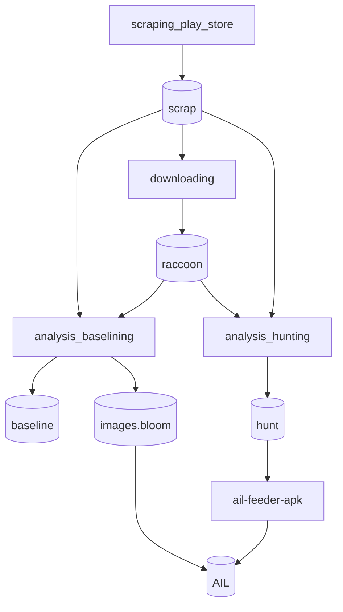

# ail-feeder-apk
This AIL feeder pushes annotated APK to an AIL instance for yara detection.

# Concepts and Workflow

It goes something like this:



1. fill out `etc/ail-feeder-apk.cfg` to define which keywords to search for, what developper certificates are trusted, AIL credentials, raccoon installation, etc.
2. use `bin/scrap_playstore.py` to scrap the applications on the playstore that correspond to your keywords - the results are placed into the `scrap` lmdb,
3. use `bin/download_apks.py` to download/update all the .apk files through `raccoon` - the resulting files are placed in `raccoon` home folder,
4. use `bin/analysis.py baselining` to create the baseline - the resulting bloom filter is `images.bloom` by default, and a `baseline` lmdb,
5. use `bin/analysis.py hunting` to create the `hunt` lmdb,
6. use `bin/feeder-apk.py` to push the content of the `hunt` lmdb to the AIL instance.
7. The AIL instance receive `json` annotation regarding the APK, and run the corresponding `YARA` rules against these files.

for instance:
```
import "androguard"

rule andro_fleur
{
    condition:
        androguard.image(0) == 1
}
```

# Requirements
This feeder has several requirements for the AIL instances to treat its input correctly:

- an AIL instance using a yara version compiled with `androfleur` support:
  - [androfleur](https://github.com/gallypette/androguard-yara/tree/androfleur) is a modified version of [androguard-yara](https://github.com/gallypette/androguard-yara) module that supports lookup into DCSO bloom filter files.
  - an AIL fork with the correct yara version is available here: https://github.com/gallypette/ail-framework/tree/custoyara

- raccoon 4 needs to be installed and configured to use a google account, see https://raccoon.onyxbits.de/documentation/